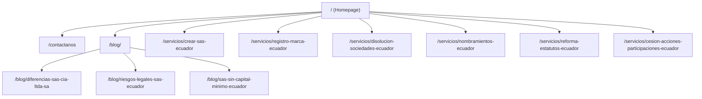
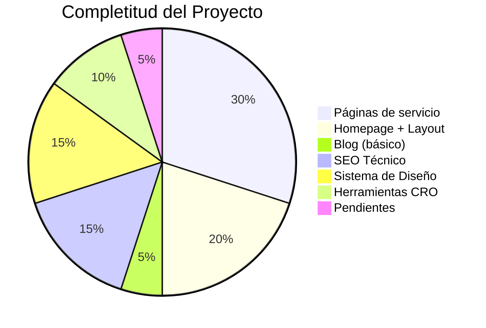

# 🔍 Análisis Completo — Constival Legal (constival.com)

**Fecha:** 31 de mayo de 2026  
**Branch activo:** `main` (30 commits)  
**Dominio:** [constival.com](https://constival.com)

---

## 1. Stack Tecnológico

| Capa | Tecnología | Versión |
|------|-----------|---------|
| Framework | Astro | v6.0.8 |
| Estilos | Tailwind CSS | v4.2.2 |
| Plugin tipografía | @tailwindcss/typography | v0.5.19 |
| SEO | @astrojs/sitemap | v3.7.2 |
| Build Tool | Vite (via Astro) | — |
| Node mínimo | ≥22.12.0 | — |
| Lenguaje | TypeScript (config) | — |

> [!TIP]
> Stack moderno y excelente. Astro v6 con Tailwind v4 es una combinación de alto rendimiento para sitios de contenido con SSG (Static Site Generation).

---

## 2. Arquitectura de Páginas (Sitemap)

El sitio cuenta con **12 URLs** indexadas en el sitemap:



### Resumen de Páginas

| Página | Estado | Prioridad Sitemap |
|--------|--------|------------------|
| **Homepage** (`/`) | ✅ Completa | 1.0 |
| **Contáctanos** (`/contactanos`) | ✅ Completa (formulario + mapa) | 0.7 |
| **Crear SAS** | ✅ Completa (9 componentes) | 0.9 |
| **Registro de Marca** | ✅ Completa (8 componentes) | 0.9 |
| **Disolución** | ✅ Completa (8 componentes) | 0.9 |
| **Nombramientos** | ✅ Completa (8 componentes) | 0.9 |
| **Reforma de Estatutos** | ✅ Completa (8 componentes) | 0.9 |
| **Cesión de Acciones** | ✅ Completa (8 componentes) | 0.9 |
| **Blog Index** | ✅ Funcional | 0.7 |
| **3 Artículos de blog** | ✅ Publicados | 0.7 |

---

## 3. Arquitectura de Componentes

### 3.1 Componentes del Homepage (10 secciones)

| # | Componente | Tamaño | Estado |
|---|-----------|--------|--------|
| 1 | [Navbar.astro](file:///c:/Users/USUARIO/Documents/GitHub/constival-legal-ia/web/src/components/Navbar.astro) | 8.2 KB | ✅ Activo |
| 2 | [Hero.astro](file:///c:/Users/USUARIO/Documents/GitHub/constival-legal-ia/web/src/components/Hero.astro) | 12.5 KB | ✅ Activo (carrusel marquee + CTA) |
| 3 | [PainSection.astro](file:///c:/Users/USUARIO/Documents/GitHub/constival-legal-ia/web/src/components/PainSection.astro) | 7.9 KB | ✅ Activo |
| 4 | [RiskGrader.astro](file:///c:/Users/USUARIO/Documents/GitHub/constival-legal-ia/web/src/components/RiskGrader.astro) | 15 KB | ✅ Activo (herramienta interactiva) |
| 5 | [WhyUs.astro](file:///c:/Users/USUARIO/Documents/GitHub/constival-legal-ia/web/src/components/WhyUs.astro) | 7.7 KB | ✅ Activo |
| 6 | [Calculator.astro](file:///c:/Users/USUARIO/Documents/GitHub/constival-legal-ia/web/src/components/Calculator.astro) | 14.1 KB | ✅ Activo (recomendador SAS/Ltda/SA) |
| 7 | [Testimonials.astro](file:///c:/Users/USUARIO/Documents/GitHub/constival-legal-ia/web/src/components/Testimonials.astro) | 11.3 KB | ✅ Activo |
| 8 | [Pricing.astro](file:///c:/Users/USUARIO/Documents/GitHub/constival-legal-ia/web/src/components/Pricing.astro) | 4.2 KB | ✅ Activo |
| 9 | [Faq.astro](file:///c:/Users/USUARIO/Documents/GitHub/constival-legal-ia/web/src/components/Faq.astro) | 3.9 KB | ✅ Activo |
| 10 | [CtaSection.astro](file:///c:/Users/USUARIO/Documents/GitHub/constival-legal-ia/web/src/components/CtaSection.astro) | 3.6 KB | ✅ Activo |
| 11 | [Footer.astro](file:///c:/Users/USUARIO/Documents/GitHub/constival-legal-ia/web/src/components/Footer.astro) | 10.5 KB | ✅ Activo |

### Componentes Comentados/Desactivados en Homepage

| Componente | Estado | Nota |
|-----------|--------|------|
| `ValueProposition` | ⚠️ Comentado en index.astro | Import existe pero el render está comentado |
| `Services` | ⚠️ Comentado en index.astro | Import existe pero el render está comentado |
| `PopupManager` | ⚠️ Comentado en index.astro | Componente existe (8.8 KB) pero no se renderiza |
| `ThemeOverride` | ⚠️ Comentado en index.astro | Componente existe (520 B) pero no se renderiza |

### 3.2 Componentes de Servicios (55 componentes total)

Cada landing de servicio sigue un **patrón consistente de 8-9 secciones**:

```
[Servicio]Hero → [Servicio]Contexto → [Servicio]Comparacion/Tipos → [Servicio]Proceso 
→ [Servicio]Requisitos → [Servicio]Cotizador → [Servicio]Faq → [Servicio]CtaFinal
```

| Servicio | Componentes | Cotizador interactivo |
|----------|-------------|----------------------|
| Crear SAS | 9 (incluye `SasPricing`) | ✅ SasCotizador (29 KB) |
| Registro Marca | 8 | ✅ MarcaCotizador (15.7 KB) |
| Disolución | 8 | ✅ DisolucionCotizador (21.8 KB) |
| Nombramientos | 8 | ✅ NombramientosCotizador (17.4 KB) |
| Reforma Estatutos | 8 | ✅ ReformaCotizador (24 KB) |
| Cesión de Acciones | 8 | ✅ CesionCotizador (15 KB) |

> [!IMPORTANT]
> Cada servicio tiene un **cotizador interactivo personalizado** — esto es un diferenciador CRO muy potente. La inversión en componentes por servicio es significativa.

### 3.3 Componentes UI Reutilizables

| Componente | Uso |
|-----------|-----|
| [Button.astro](file:///c:/Users/USUARIO/Documents/GitHub/constival-legal-ia/web/src/components/ui/Button.astro) | CTA centralizado |
| [LeafletMap.astro](file:///c:/Users/USUARIO/Documents/GitHub/constival-legal-ia/web/src/components/ui/LeafletMap.astro) | Mapa interactivo (contacto) |
| [ServiceCard.astro](file:///c:/Users/USUARIO/Documents/GitHub/constival-legal-ia/web/src/components/ui/ServiceCard.astro) | Tarjeta de servicio |

---

## 4. Sistema de Diseño

### 4.1 Paleta de Colores (tokens Tailwind v4)

| Token | Valor | Uso |
|-------|-------|-----|
| `constival-mint` | `#00FFB2` | CTAs, acentos, highlights |
| `constival-teal` | `#2C4747` | Elementos de resalte corporativo |
| `constival-navy` | `#111622` | Fondo oscuro / texto claro |
| `constival-deep` | `#111E45` | Fondos de tarjetas |
| `constival-blue` | `#234285` | Elementos secundarios |
| `dark-teal` | `#0D1A1A` | Fondo ultra-oscuro |

### 4.2 Tipografías (Self-Hosted)

| Familia | Pesos | Uso |
|---------|-------|-----|
| **Outfit** | 300–900 (7 @font-face) | Headlines, UI, textos principales |
| **Playfair Display** | 400, 400i, 600, 700 | Acentos editoriales, serif jurídico |

> [!TIP]
> Las fuentes están auto-alojadas con preload en `Layout.astro` — excelente para LCP y evita dependencia de Google Fonts CDN.

### 4.3 Utilidades Tipográficas Semánticas

Definidas en [global.css](file:///c:/Users/USUARIO/Documents/GitHub/constival-legal-ia/web/src/styles/global.css) como `@utility`:

| Utility | Uso | Mobile → Desktop |
|---------|-----|-------------------|
| `text-hero` | H1 (Hero) | 4xl → 5xl → 6xl |
| `text-section-title` | H2 (Secciones) | 3xl → 4xl → 5xl |
| `text-display-title` | H2 (Blog, landings) | 4xl → 5xl → 6xl |
| `text-blog-title` | H1 Blog | 3xl → 4xl → 5xl → 3.375rem |
| `text-card-title` | H3 Tarjetas | xl → 2xl |
| `text-feature-title` | H3 Features | sm → base |
| `text-body-lead` | Párrafo lead | base → lg → xl |
| `text-body` | Párrafo apoyo | sm → base |
| `text-badge` | Insignias | xs → sm |
| `text-fine` | Disclaimers | xs |

### 4.4 Animaciones

- `fade-in`, `slide-up`, `slide-in-right`, `pulse-glow` (keyframes)
- `animate-marquee` (carrusel infinito del Hero)
- Animaciones pausables al hover en el carrusel

---

## 5. SEO y Schema Markup

### 5.1 Meta Tags ✅

| Elemento | Estado |
|----------|--------|
| `<title>` dinámico | ✅ Por página |
| `<meta description>` | ✅ Por página |
| Open Graph (title, desc, image, type, locale) | ✅ Completo |
| Twitter Card (summary_large_image) | ✅ Completo |
| `<link rel="canonical">` | ✅ Dinámico |
| `lang="es"` | ✅ En `<html>` |

### 5.2 Schema (JSON-LD) ✅

| Schema | Donde |
|--------|-------|
| `LegalService` | Layout global (organización) |
| `WebSite` + `SearchAction` | Layout global |
| Slot `<head>` para schemas por página | ✅ Disponible |

### 5.3 robots.txt ✅ Avanzado

- Permite todos los bots principales (Google, GPTBot, ClaudeBot, PerplexityBot, Bingbot, FacebookBot)
- Bloquea `CCBot` (crawlers de entrenamiento)
- Apunta correctamente al sitemap

### 5.4 Sitemap ✅

- Generado automáticamente via `@astrojs/sitemap`
- Prioridades configuradas por tipo de página (servicios=0.9, blog=0.7, home=1.0)
- Redirect 301: `/crear-sas-ecuador` → `/servicios/crear-sas-ecuador`

---

## 6. Blog / Content System

### Estado Actual

| Métrica | Valor |
|---------|-------|
| Artículos publicados | **3** |
| CMS | Astro Content Collections (file-based) |
| Formatos soportados | `.md`, `.mdx` |
| Routing | Dinámico (`[slug].astro`) |
| Schema del blog | title, description, pubDate, author, image, tags, draft, relatedService |

### Artículos Existentes

1. `diferencias-sas-cia-ltda-sa.md` — 5.7 KB
2. `riesgos-legales-sas-ecuador.md` — 5.9 KB
3. `sas-sin-capital-minimo-ecuador.md` — 8.4 KB

> [!WARNING]
> **Solo 3 artículos de blog**, todos centrados en el tema SAS. Para una estrategia de contenido completa, se necesitan artículos cubriendo marcas, disoluciones, nombramientos, reformas y temas legales generales.

---

## 7. Formulario de Contacto

| Aspecto | Estado |
|---------|--------|
| Backend | Google Sheets vía Apps Script (`.env → SHEETS_KEY`) |
| Validación | Client-side (nombre + teléfono obligatorios) |
| Campos | Nombre*, Email, Teléfono*, Servicio (select), Mensaje |
| UX | Loading spinner, estado de éxito, error con fallback a WhatsApp |
| Privacidad | Disclaimer de confidencialidad |

---

## 8. Herramientas Interactivas (CRO Tools)

### 8.1 Calculador de Tipo Societario (`Calculator.astro`)
- **5 preguntas** con sistema de pesos
- Recomienda SAS vs Cía. Ltda. vs S.A.
- Incluye tabla de eficiencia (Constival vs tradicional)

### 8.2 Auditor de Riesgos Societarios (`RiskGrader.astro`)
- **4 preguntas** de riesgo
- Scoring: Alerta Roja / Riesgo Moderado / Estructura Sólida
- CTAs con mensajes pre-redactados para WhatsApp

### 8.3 Cotizadores por Servicio (6 individuales)
- Cada landing tiene un cotizador interactivo personalizado
- Generan presupuestos específicos según variables del servicio

> [!TIP]
> Las herramientas interactivas son un activo CRO diferenciador enorme — pocas firmas legales en LATAM tienen algo similar.

---

## 9. Assets y Rendimiento

### Imágenes

| Asset | Formato | Tamaño |
|-------|---------|--------|
| hero-bg.webp | WebP | 161 KB ✅ |
| hero-bg.png | PNG | 1.7 MB ⚠️ (backup sin optimizar) |
| hero-bg.jpg | JPEG | 487 KB |
| og-image.png | PNG | 21 KB ✅ |
| blog_sas.png | PNG | 435 KB |
| default-blog-bg.png | PNG | 833 KB ⚠️ |

### Optimización de Rendimiento

| Aspecto | Estado |
|---------|--------|
| Font preload (Outfit 400 + 700) | ✅ |
| Hero background preload (webp) | ✅ |
| Font-display: swap | ✅ |
| Scroll-behavior: smooth | ✅ |
| Dark mode flash prevention | ✅ (script inline) |
| CSS transitions (300ms) | ✅ |

> [!NOTE]
> Existen reportes Lighthouse generados previamente (`lighthouse-phase2.json` y `lighthouse-phase2-final.json`) indicando que ya se ha trabajado en optimización de rendimiento.

---

## 10. Documentación Estratégica

Se encontraron **11 documentos** de estrategia en [.agents/](file:///c:/Users/USUARIO/Documents/GitHub/constival-legal-ia/.agents):

| Documento | Contenido |
|-----------|-----------|
| `product-marketing-context.md` | Contexto completo de producto, personas, competencia |
| `homepage-copy-strategy.md` | Estrategia de copy del homepage |
| `cro-strategy.md` | Estrategia de optimización de conversión |
| `landing-services-blueprint.md` | Blueprint de landings de servicio |
| `popup-strategy.md` | Estrategia de popups (no implementada aún) |
| `email-sequence-strategy.md` | Estrategia de secuencias de email |
| `onboarding-strategy.md` | Estrategia de onboarding |
| `free-tool-strategy.md` | Estrategia de herramientas gratuitas |
| `ab-testing-roadmap.md` | Roadmap de A/B testing |
| `qa-audit-constival-com.md` | Auditoría QA |
| `constival_business_summary.md` | Resumen de negocio |

---

## 11. Resumen del Estado Actual



### ✅ Lo que está BIEN (Fortalezas)

1. **Stack técnico moderno y bien configurado** — Astro v6 + Tailwind v4 es una combinación premium
2. **6 landing pages de servicio completas** con cotizadores interactivos individuales
3. **Sistema de diseño coherente** con tokens semánticos, fuentes self-hosted y dark mode
4. **SEO técnico sólido** — Schema markup, OG tags, canonical URLs, sitemap inteligente
5. **robots.txt optimizado para AI search** (permite GPTBot, ClaudeBot, Perplexity)
6. **Herramientas interactivas CRO** — Calculador societario + Auditor de riesgos
7. **Formulario de contacto funcional** con integración a Google Sheets
8. **Brand guidelines documentadas** como fuente de verdad
9. **Datos centralizados** en `company.ts` para fácil mantenimiento
10. **Arquitectura de componentes modular** y bien organizada

### ⚠️ Lo que FALTA / Necesita Atención

| Prioridad | Elemento | Estado |
|-----------|----------|--------|
| 🔴 Alta | **Blog con solo 3 artículos** — Falta contenido para marcas, disoluciones, nombramientos, reformas | Solo temas SAS |
| 🔴 Alta | **PopupManager desactivado** — Estrategia de popups documentada pero no implementada | Comentado |
| 🟡 Media | **Imágenes sin optimizar** — `default-blog-bg.png` (833 KB) y `hero-bg.png` (1.7 MB) en formato PNG | Solo WebP del hero está optimizado |
| 🟡 Media | **ValueProposition y Services comentados** — 2 componentes del homepage desactivados | Decisión intencional? |
| 🟡 Media | **Dark mode desactivado por defecto** — El sistema funciona pero fuerza `light` siempre | Script fija `"light"` |
| 🟡 Media | **Sin Google Analytics / tracking** — No hay GA4, GTM ni tracking de eventos | Sin scripts de analytics |
| 🟡 Media | **Sin schema de servicio individual** — Las landings podrían tener `Service` schema específico | Solo schema global |
| 🟢 Baja | **Directorios vacíos** — `components/layouts/` y `components/data/` están vacíos | Limpieza de estructura |
| 🟢 Baja | **Directorio `marcas/` (plural) vacío** junto a `marca/` (singular) con componentes | Posible duplicado |
| 🟢 Baja | **`stitch-home.html`** en raíz de `/web` — archivo de diseño que no debería estar en producción | 21 KB estático |

---

## 12. Recomendaciones para Siguiente Fase

### Fase Inmediata (Quick Wins)

1. **Activar PopupManager** — Ya existe el componente y la estrategia documentada
2. **Agregar tracking** — GA4 + eventos de conversión en cotizadores y formulario
3. **Optimizar imágenes** — Convertir PNGs del blog a WebP
4. **Añadir schema `Service` por landing** — Aprovechando el slot `<head>` existente
5. **Limpiar directorios vacíos** y archivo `stitch-home.html`

### Fase de Contenido

6. **Expandir blog** — Mínimo 2-3 artículos por cada servicio (12+ artículos)
7. **Crear páginas comparativas** (`/blog/sas-vs-cia-ltda`) para SEO de cola larga
8. **Añadir testimonios reales** con fotos y empresa

### Fase de CRO Avanzado

9. **Implementar secuencia de emails** (estrategia ya documentada)
10. **Activar A/B testing** (roadmap ya documentado)
11. **Herramienta gratuita standalone** (estrategia ya documentada)

> [!IMPORTANT]
> El proyecto está en un estado de **madurez alta para MVP**. La arquitectura, el diseño y las landing pages de servicio están completas y bien ejecutadas. Los mayores gaps son en **contenido** (blog), **tracking** (analytics) y **activación de features ya construidas** (popup, dark mode).
